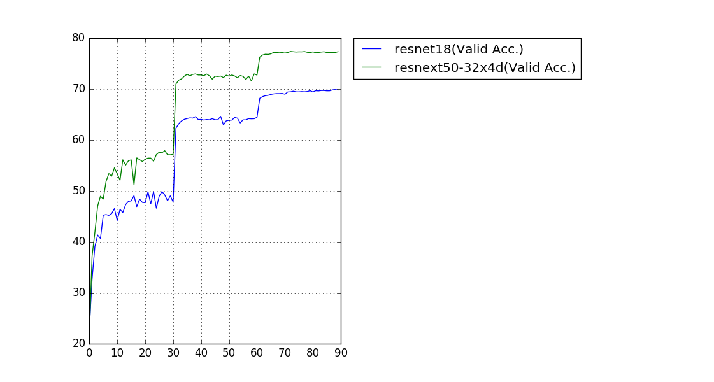

# 目的：专用于集成各网络主干
clone from：https://github.com/bearpaw/pytorch-classification/blob/master/TRAINING.md （cifar&&imagenet&&curves）

## Install
* Install [PyTorch](http://pytorch.org/)
* Clone recursively
  ```
  git clone --recursive git@github.com:lcaikk1314/pytorch-classification.git
  ```
  
## 文件组织结构
models        : 模型定义
models_init   : 初始模型，从别的github获取的
models_onnx   : 转出的ONNX模型存储位置

## 模型添加规则
按文件组织结构操作

## 处理流程

### mobilev3_train.sh   : 训练调优模型使用脚本

python3 imagenet.py \
--arch MobileNetV3 \
--data ../imagenet/ \
--epochs 30 --schedule 11 21  --lr 0.0005 --gpu-id 0,1 \
--model_path './models_init/mbv3_large.pth.tar' \
--checkpoint checkpoints_MobileNetV3_Large/imagenet/MobileNetV3

### mobilev3_evaluate.sh : 模型评估，评估的指标：精度、计算量、参数量

python3 imagenet.py \
--arch MobileNetV3 \
--data ../imagenet/ \
--gpu-id 0,1,2,3 \
--model_path './models_init/mbv3_large.pth.tar' \
--evaluate

### mobilev3_convert.sh  : 模型转化为ONNX使用；

python3 convertonnx.py \
--arch MobileNetV3 \
--model_path './models_init/mbv3_large.pth.tar' \
--dest_path './models_onnx/mbv3_large.onnx' 

## models expert
| Model                | Params (M)  | MFLOPS  | model size(M)|  Top-1 Error(%)| Top-5 Error(%)|1threadtimes(ms)|2threadtimes(ms)|VSS(K) |RSS(K)|
| -------------------  | ------------| --------| -------------| ---------------| --------------|----------------|----------------|-------|------|
| mobileV3-large       | 3.96        | 271.036 | 30.3         | 29.212         | 10.59         |89.649          |59.5683         |61916  |49112 |
| mobileV3-small       | 2.51        | 65.558  | 19.2         | 35.074         | 14.534        |29.9176         |18.8802         |42972  |33668 |
| efficientnet-b0      | 5.289       | 401.679 | 20.4         | 23.57          | 6.952         |145.293         |134.429         |103900 |82436 |
| efficientnet-b1      | 7.794       | 591.948 | 30.1         | 21.628         | 5.964         |236.81          |202.56          |122844 |103528|
| efficientnet-b2      | 9.110       | 682.357 | 35.1         | 23.04          | 6.81          |296.041         |222.683         |137692 |114812|
| efficientnet-lite0   | 4.652       | 398.727 | 17.9         | 24.606         | 7.500         |109.905         |63.9615         |69596  |52736 |
| regnet200m           | 4.151       | 255.463 | 15.9         | 29.91          | 10.466        |63.1528         |37.8787         |69084  |45972 |
| regnet400m           | 5.74        | 513.125 | 22.0         | 26.21          | 8.282         |141.344         |76.282          |83932  |65632 |
| regnet600m           | 6.633       | 595.577 | 25.4         | 25.27          | 7.648         |                |                |       |      |
| ghostnetv1           | 5.183       | 148.788 | 19.9         | 26.02          | 8.538         |63.1484         |36.6433         |72292  |55764 |
| Shufflenet_V2_1.0    | 2.28        | 148.809 | 8.78         | 30.64          | 11.684        |45.672          |29.876          |37340  |27404 |

- [x] [mobileNetV3](https://github.com/xiaolai-sqlai/mobilenetv3)
- [x] [efficientNet](https://github.com/lukemelas/EfficientNet-PyTorch)
- [x] [shuffleNetV2](https://github.com/ericsun99/Shufflenet-v2-Pytorch)
- [x] [GhostNet](https://github.com/huawei-noah/ghostnet)
- [x] [RegNet](https://github.com/zgcr/pytorch-ImageNet-CIFAR-COCO-VOC-training)
- [x] [EfficientNetLite](https://github.com/rwightman/pytorch-image-models)

## models NAS
| Model                | Params (M)         | MFLOPS             | model size(M)      |  Top-1 Error (%)   | Top-5 Error  (%)   |
| -------------------  | ------------------ | ------------------ | ------------------ | ------------------ | ------------------ |
|                      |                    |                    |                    |             |                   |
|                      |                    |                    |                    |                    |                    |


# pytorch-classification
Classification on CIFAR-10/100 and ImageNet with PyTorchV1.0.

## Features
* Unified interface for different network architectures
* Multi-GPU support
* Training progress bar with rich info
* Training log and training curve visualization code (see `./utils/logger.py`)

## Install
* Install [PyTorch](http://pytorch.org/)
* Clone recursively
  ```
  git clone --recursive https://github.com/bearpaw/pytorch-classification.git
  ```

## Training
Please see the [Training recipes](TRAINING.md) for how to train the models.

## Results

### CIFAR
Top1 error rate on the CIFAR-10/100 benchmarks are reported. You may get different results when training your models with different random seed.
Note that the number of parameters are computed on the CIFAR-10 dataset.

| Model                     | Params (M)         |  CIFAR-10 (%)      | CIFAR-100 (%)      |
| -------------------       | ------------------ | ------------------ | ------------------ |
| alexnet                   | 2.47               | 22.78              | 56.13              |
| vgg19_bn                  | 20.04              | 6.66               | 28.05              |
| ResNet-110                | 1.70               | 6.11               | 28.86              |
| PreResNet-110             | 1.70               | 4.94               | 23.65              |
| WRN-28-10 (drop 0.3)      | 36.48              | 3.79               | 18.14              |
| ResNeXt-29, 8x64          | 34.43              | 3.69               | 17.38              |
| ResNeXt-29, 16x64         | 68.16              | 3.53               | 17.30              |
| DenseNet-BC (L=100, k=12) | 0.77               | 4.54               | 22.88              |
| DenseNet-BC (L=190, k=40) | 25.62              | 3.32               | 17.17              |


### ImageNet
Single-crop (224x224) validation error rate is reported. 


| Model                | Params (M)         |  Top-1 Error (%)   | Top-5 Error  (%)   |
| -------------------  | ------------------ | ------------------ | ------------------ |
| ResNet-18            | 11.69              |  30.09             | 10.78              |
| ResNeXt-50 (32x4d)   | 25.03              |  22.6              | 6.29               |



## Pretrained models
Our trained models and training logs are downloadable at [OneDrive](https://mycuhk-my.sharepoint.com/personal/1155056070_link_cuhk_edu_hk/_layouts/15/guestaccess.aspx?folderid=0a380d1fece1443f0a2831b761df31905&authkey=Ac5yBC-FSE4oUJZ2Lsx7I5c).

## Supported Architectures

### CIFAR-10 / CIFAR-100
Since the size of images in CIFAR dataset is `32x32`, popular network structures for ImageNet need some modifications to adapt this input size. The modified models is in the package `models.cifar`:
- [x] [AlexNet](https://arxiv.org/abs/1404.5997)
- [x] [VGG](https://arxiv.org/abs/1409.1556) (Imported from [pytorch-cifar](https://github.com/kuangliu/pytorch-cifar))
- [x] [ResNet](https://arxiv.org/abs/1512.03385)
- [x] [Pre-act-ResNet](https://arxiv.org/abs/1603.05027)
- [x] [ResNeXt](https://arxiv.org/abs/1611.05431) (Imported from [ResNeXt.pytorch](https://github.com/prlz77/ResNeXt.pytorch))
- [x] [Wide Residual Networks](http://arxiv.org/abs/1605.07146) (Imported from [WideResNet-pytorch](https://github.com/xternalz/WideResNet-pytorch))
- [x] [DenseNet](https://arxiv.org/abs/1608.06993)

### ImageNet
- [x] All models in `torchvision.models` (alexnet, vgg, resnet, densenet, inception_v3, squeezenet)
- [x] [ResNeXt](https://arxiv.org/abs/1611.05431)
- [ ] [Wide Residual Networks](http://arxiv.org/abs/1605.07146)


## Contribute
Feel free to create a pull request if you find any bugs or you want to contribute (e.g., more datasets and more network structures).
